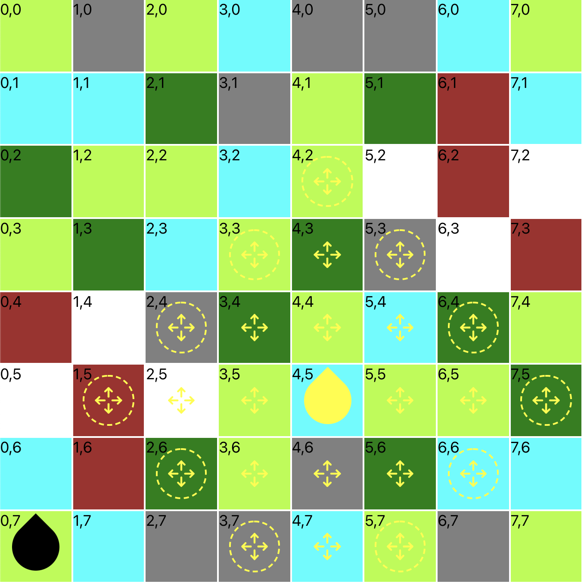

# Machine strike

Basically machine strike logic implementation in TS based on the machine strike board game from Horizon Forbidden West.

## Things implemented
- symmetric random board generation
- movement calculation
- movement on board (with esc you end turn)
- rotation (hardcoded only)

## Things not implemented
- gameplay
- rendering stats
- rendering weakpoints
- player interaction
- ...

## Current state

